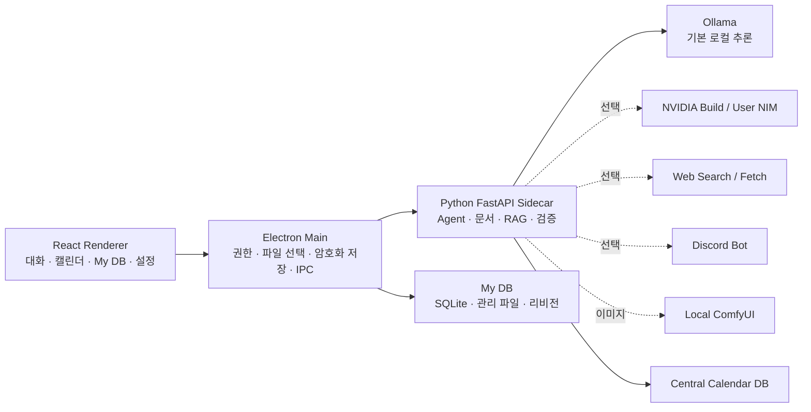

<div align="center">


# Aiso

**로컬 작업·조사·자동화·검증을 위한 크리에이터 워크스페이스**

개인 파일, 문서, 일정, 지식 라이브러리와 로컬 AI를 한 곳에서 다루고, 필요한 작업은 실제 도구 실행 결과로 확인합니다.

[](docs/V1.0.1_RELEASE_NOTES.md)


[시작하기](#시작하기) · [핵심 기능](#핵심-기능) · [보안과 데이터 경계](#보안과-데이터-경계) · [진단·설정](#8-진단-센터와-설정) · [개발과 배포](#개발과-배포) · [제약사항](#제약사항)

</div>

---

## Aiso는 무엇인가

Aiso는 **개인 창작·개발 작업을 정리하고 검증하는 Windows 데스크톱 워크스페이스**입니다. 기본 추론은 사용자가 설치한 Ollama에서 로컬로 실행하며, 필요할 때만 NVIDIA Build API·사용자 운영 NIM·웹 조사·Discord·ComfyUI 같은 선택 기능을 연결합니다.

단순 대화창이나 범용 자동 코딩 도구를 지향하지 않습니다. Aiso는 아래 네 가지를 하나의 흐름으로 연결합니다.

1. **이해** — 작업 폴더, 첨부 파일, 문서와 My DB의 자료를 필요한 범위에서 읽습니다.
2. **정리** — 문서 근거에서 일정 후보를 만들고, 개인 파일을 코어 중심의 My DB 라이브러리로 관리합니다.
3. **실행** — 사용자가 켠 도구와 권한 범위 안에서 파일, 코드, 웹, Discord, 이미지 생성을 수행합니다.
4. **검증** — 결과를 다시 읽거나 명령·브라우저 상호작용으로 확인하고, 성공하지 않은 일을 성공했다고 말하지 않도록 실행 결과를 중심으로 표시합니다.

로컬 모델은 모든 일을 똑같이 잘하지 않습니다. Aiso는 이 한계를 숨기지 않고, 명확한 요청에는 필요한 도구만 좁혀 노출하고, 불확실하거나 복합적인 작업은 단계별 실행·근거·결과 카드로 관리하도록 설계했습니다.

## 한눈에 보는 구성

| 영역 | 역할 | 저장 위치와 범위 |
|---|---|---|
| Aiso 채팅 | 일반 대화, 첨부 자료 기반 질의, 필요 시 웹 조사 | 대화 기록은 앱 데이터, 첨부는 별도 임시 보관소 |
| Aiso 에이전트 | 작업 폴더·문서·웹·코드·캘린더·이미지 도구를 사용한 실행형 작업 | 작업 폴더 접근은 사용자가 지정한 범위로 제한 |
| 캘린더 | 문서 근거 일정과 직접 등록 일정을 중앙에서 관리 | 작업 폴더와 독립된 Aiso 캘린더 DB |
| My DB | 코어·파일·관계를 시각화하는 개인 NAS형 라이브러리 | 사용자 지정 My DB 저장소, 에이전트 이력과 분리 |
| ComfyUI | 등록·검증한 로컬 모델과 워크플로로 이미지 생성 | 로컬 ComfyUI 서버와 사용자 모델 파일 |
| Discord | 서버 구조 조회·구성, 메시지 전송, 예약 브리핑·채널 보고 | 사용자가 연결하고 허용한 Discord 서버·채널 |
| 진단 센터 | 백엔드, LLM, ComfyUI, 작업 폴더, Discord 연결 상태 점검 | 읽기 전용 상태 확인 |

## 핵심 기능

### 1. 대화와 실행형 에이전트

사이드바에서 **Aiso 채팅**과 **Aiso 에이전트**를 구분합니다.

- 채팅은 일반 질의, 첨부 자료 해설, 조사 결과 정리에 적합합니다.
- 에이전트는 프로젝트 또는 독립 채팅에서 작업 폴더를 선택해 파일·문서·코드·웹 검증 도구를 실행합니다.
- 프로젝트 아래에 여러 에이전트 대화를 만들 수 있고, 프로젝트에 귀속되지 않은 독립 에이전트 대화도 만들 수 있습니다.
- 최근 대화는 이름 변경, 고정, 삭제로 관리합니다.
- 요청 언어를 기준으로 최종 답변 언어를 유지합니다. 첨부 원문이나 도구 출력의 언어가 사용자의 질문 언어를 덮어쓰지 않도록 분리합니다.

#### 요청별 도구 라우팅

모든 도구를 매번 모델에 보여 주는 대신, 명확한 요청은 먼저 분류해 필요한 범위만 제공합니다.

| 요청 예시 | 우선 실행 흐름 |
|---|---|
| `현재 작업 폴더 파일 구조 보여줘` | 폴더 트리 조회 |
| `기말.pdf를 읽고 요약해줘` | 해당 문서 읽기·요약 |
| `문서에서 할 일을 뽑아 캘린더에 저장해줘` | 문서 분석 → 근거 기반 캘린더 저장 |
| `현재 일정 보여줘` | 중앙 캘린더 조회 — 작업 폴더 불필요 |
| `오늘 기준 최신 OpenAI 뉴스 조사해줘` | 웹 검색 → 출처 본문 확인 → 보고 |
| `검색한 캐릭터 특징으로 그림을 그려줘` | 웹 조사 → 근거 확인 → ComfyUI 생성 |
| `HTML을 수정하고 클릭까지 검증해줘` | 읽기·수정 → 브라우저 실행 → 상호작용 검증 |

이 사전 라우팅은 모델의 판단을 완전히 대체하지 않습니다. 대신 작은 로컬 모델이 무관한 도구를 고르거나, 파일 구조 조회에 문서 캘린더 저장 도구를 호출하는 일을 줄이고, 실행 경계에서도 허용되지 않은 호출을 차단합니다.

#### 작업 폴더 도구

작업 폴더를 지정하면 에이전트는 다음과 같은 범위의 도구를 사용할 수 있습니다. 실제 노출 여부는 `설정 → 도구`의 공급자별 ON/OFF 정책과 현재 권한 모드에 따라 달라집니다.

- 파일·폴더 트리 조회, 이름·본문 검색, 파일 읽기
- 폴더 생성, 파일 작성·편집·이동·이름 변경·삭제
- PDF, PowerPoint, Word, Excel, HWP/HWPX의 텍스트 추출과 문서 변환
- 작업 폴더 RAG 색인과 관련 문서 조각 검색
- Python, C, C++, C# 코드 작성·편집·실행
- HTML/CSS/JavaScript 페이지의 로드·클릭·키 입력·화면 변화 검증
- 제한된 명령 실행과 결과 수집
- 재사용 가능한 Python 스킬 생성·실행

프로그래밍 도구는 기본적으로 꺼져 있습니다. 성능이 충분하지 않은 로컬 모델에서는 파일·문서 작업만 켜고, 도구 호출 품질을 확인한 NVIDIA 모델 등에서 프로그래밍 묶음을 켜는 방식을 권장합니다.

### 2. 문서·첨부 분석

채팅과 에이전트 입력창에서 파일·폴더를 드래그 앤 드롭하거나 `+` 버튼으로 첨부할 수 있습니다. 첨부는 작업 폴더와 별도의 임시 보관소로 가져오므로, 폴더를 다시 지정하지 않아도 대화 문맥에 넣을 수 있습니다.

지원하는 주요 문서 형식은 다음과 같습니다.

| 형식 | 읽기·근거 추출 | 주요 근거 단위 |
|---|---:|---|
| PDF | 지원 | 페이지 |
| PowerPoint `.pptx`, `.pptm` | 지원 | 슬라이드 |
| Word `.docx` | 지원 | 문단·표 |
| Excel `.xlsx`, `.xlsm` | 지원 | 시트·행 |
| 한글 `.hwp`, `.hwpx` | 지원 | 추출 가능한 본문 |
| Markdown·텍스트 | 지원 | 줄·구간 |

문서에서 캘린더 일정을 만들 때는 제목만 나열하지 않고 원문 파일, 페이지·슬라이드·구간과 인용 근거를 함께 저장합니다. 원문 근거 확인은 해당 작업을 만든 에이전트 대화에서 이어서 볼 수 있습니다.

### 3. 캘린더

캘린더는 프로젝트별 파일이 아니라 **Aiso가 제공하는 중앙 데이터**입니다. 작업 폴더가 없어도 조회·등록·수정할 수 있습니다.

- 오늘, 일간, 주간, 월간, 목록 보기
- 연도·월 이동과 월간/연간 전환
- 시간 단위 일정과 시작·종료 시간
- 기간 일정, 드래그 이동, 양끝 조절로 기간 변경
- `P1`, `P2` 등 우선순위와 완료 상태
- 매일·매주·매년 등 자연어 반복 일정
- 우클릭으로 기한·제목·우선순위 변경 또는 삭제
- 문서 근거 기반 일정 후보 저장
- 미완료 작업 시간의 재분배 제안
- 명확한 전체 삭제 요청에만 동작하는 전체 일정 삭제

반복 일정은 발생 건을 무한히 복제하는 방식이 아니라 규칙과 기준일을 저장하고, 화면에서 해당 기간의 발생 건을 계산합니다. 따라서 매주·매년 일정을 관리할 때 데이터가 불필요하게 늘어나지 않습니다.

### 4. My DB — 개인 파일 라이브러리와 지식 그래프

My DB는 에이전트가 만든 작업 결과를 자동으로 쌓아 두는 공간이 아닙니다. 사용자가 직접 가져온 파일과 폴더를 보관·관계화하는 **독립 개인 라이브러리**입니다.

#### 데이터 모델

- **코어**: 폴더·주제·프로젝트와 같은 상위 단위
- **파일**: My DB가 관리하는 실제 복사본
- **관계**: 포함(`contains`), 연결(`related`), 참조(`references`), 의존(`depends_on`)
- **휴지통**: 삭제 즉시 영구 제거하지 않고 복원 가능한 상태로 보관
- **이력·리비전**: 이름 변경, 가져오기, 연결, 복원, 내용 변경, 구조 복원, 내보내기 기록

파일이나 폴더를 My DB로 가져오면, 외부 경로를 단순 참조하는 것이 아니라 사용자 지정 저장소 안에 복사본을 보관합니다. 저장소는 기본적으로 `문서\Aiso My DB`이며 `설정 → DB`에서 바꿀 수 있습니다. 파일명과 코어 계층을 유지해 관리하되, 충돌이 생기면 안전한 이름으로 구분합니다.

#### 그래프와 목록

- 전체 그래프에서 코어·파일·관계를 확인
- 중간 코어를 선택하면 해당 코어와 하위 구조에 집중하는 포커스 보기
- `Esc` 또는 마우스 뒤로 가기로 전체 보기 복귀
- 캔버스 이동, 휠 확대·축소, 노드 드래그와 자연스러운 재배치
- 빈 공간 우클릭으로 코어 생성·검색
- 노드 우클릭으로 이름 변경, 연결, 연결 해제, 삭제
- 연결 중에는 점선 가이드와 검색·직접 선택으로 대상 지정
- 목록 보기에서 최상위 코어부터 하위 코어·파일을 계층적으로 탐색
- 파일 유형 필터, 검색, 폴더 접기·펼치기
- 선택한 코어의 하위 구조를 일반 폴더 형태로 내보내기

#### 변경 이력과 복구

My DB는 파일 리비전과 그래프 구조 체크포인트를 별도로 보관합니다.

- 텍스트 파일은 이전 리비전과의 줄 단위 차이를 확인할 수 있습니다.
- 파일 리비전을 선택해 이전 내용으로 복원할 수 있습니다.
- 특정 시점의 코어·관계 그래프를 구조 체크포인트로 되돌릴 수 있습니다.
- 앱이 켜져 있을 때 전날 변경 내역을 날짜별로 한 번만 요약 보고합니다.
- 일일 보고는 최상위 코어를 기준으로 하위 코어와 생성·변경된 파일을 단계적으로 정리합니다.
- 보고서 확인 주기는 `설정 → DB`에서 1~24시간으로 설정할 수 있으며, 기본값은 6시간입니다.

선택적으로 외부 원본 파일을 My DB 파일에 연결할 수 있습니다. 이 경우 원본의 변경을 My DB 복사본으로 반영하고 리비전을 남기는 **일방향 동기화**를 사용합니다. My DB 복사본을 수정했다고 외부 원본을 임의로 덮어쓰지는 않습니다.

#### 에이전트와 My DB의 경계

에이전트는 My DB에 대해 다음의 제한된 작업만 할 수 있습니다.

- 라이브러리 메타데이터 조회
- 이력과 일일 보고 조회
- 휴지통 항목 조회 및 복원

에이전트는 My DB에서 파일 가져오기, 작성·수정·삭제, 관계 연결·해제, 내보내기를 할 수 없습니다. 개인 NAS형 라이브러리의 소유권은 항상 사용자에게 남습니다.

### 5. ComfyUI 이미지 생성

Aiso는 사용자가 설치한 **로컬 ComfyUI**에 연결합니다. 서버 주소와 설치 경로를 설정하면 연결 상태, 모델, 워크플로를 점검하고, 등록·검증된 조합만 에이전트 이미지 생성에 사용합니다.

- ComfyUI 시작·연결 상태 확인
- 모델 파일과 사용자 워크플로 가져오기
- SD 1.5, SDXL, FLUX 계열의 확인된 자동 워크플로 지원
- 수동 모델 선택 또는 등록 모델 기반 자동 선택
- SDXL 자동 워크플로의 선택적 고품질 보정 단계
- 실제 전송 프롬프트, 네거티브 프롬프트, 시드, 처리 노드와 결과 경로 표시
- 명시적 그림 요청에서 좁은 이미지 도구 범위로 실행
- `검색 후 그려줘` 요청에서 웹 조사 근거를 확보한 뒤 이미지 생성
- 이미지 생성 성공 이벤트가 없으면 생성 완료 문구를 결과로 남기지 않는 검증된 결과 카드

모든 ComfyUI 모델과 커스텀 노드를 자동 지원하는 것은 아닙니다. Aiso는 확인 가능한 API 노드 계약과 모델 프로필에만 자동 워크플로를 적용하며, 그 밖의 모델은 사용자가 검증한 워크플로를 등록해야 합니다.

### 6. 웹 조사

최신성 또는 출처 확인이 필요한 요청에는 웹 검색과 본문 가져오기를 조합합니다.

- 검색 결과만 나열하지 않고, 공개 URL과 충분한 본문을 확인한 뒤 요약
- 최신 뉴스·공지·가격·정책처럼 시간에 민감한 요청에 적합
- 조사 결과를 Discord 공지·보고 흐름과 연결 가능
- 웹 검색 도구가 꺼져 있거나 근거가 부족하면 조사 후 이미지 생성·외부 전송으로 성급하게 진행하지 않음
- 작업 폴더의 로컬 자료와 웹 검색은 별도 문맥으로 취급

웹 조사는 외부 네트워크를 사용합니다. 완전한 로컬 사용이 필요하다면 `설정 → LLM` 또는 해당 도구 정책에서 웹 조사 기능을 끌 수 있습니다.

### 7. Discord 자동화

Discord는 기본적으로 꺼져 있으며, 봇 토큰과 연결을 사용자가 설정해야 합니다.

- 서버의 카테고리·채널 구조 조회
- 서버 구성 적용
- 지정 채널에 메시지 전송
- 지정 시각의 예약 브리핑 생성·목록·삭제
- 일정 간격으로 새 메시지만 모아 지정 채널에 보고하는 채널 보고 예약
- Discord에서 첨부된 파일을 읽고 분석하는 대화 흐름
- 최신 정보 요청에서는 Discord 봇도 조사 도구를 우선 사용하도록 라우팅

예약·채널 보고는 Aiso 백엔드가 실행 중일 때만 동작합니다. 창을 닫은 뒤에도 계속 실행하려면 트레이 상주와 자동 실행 설정을 사용하세요.

### 8. 진단 센터와 설정

설정의 첫 화면인 **진단 센터**는 반복 실행형 테스트가 아니라 현재 연결 상태를 필요한 시점에 확인하는 화면입니다.

| 설정 영역 | 관리 항목 |
|---|---|
| 진단 센터 | Aiso 백엔드, Ollama/NVIDIA, ComfyUI, Discord, 작업 폴더 상태 |
| LLM | Ollama 주소·모델, NVIDIA Build/NIM, 컨텍스트 길이, 추론 강도, 온도, 모델 기능 검사 |
| ComfyUI | 서버 주소, 설치 경로, 모델·워크플로 등록, 자동/수동 모델 선택 |
| DB | My DB 저장소 위치, 전날 보고 확인 주기, 전체 라이브러리 삭제 |
| Discord | 봇 연결, 트레이 상주, 자동 시작, LLM 공급자 |
| 화면 | 라이트·다크·시스템 테마 |
| 도구 | 공급자별 도구 ON/OFF, 권한 모드, 프로그래밍 묶음 |
| 스킬 | 재사용 가능한 Python 자동화 스킬 |
| 업데이트 | 앱 버전과 업데이트 상태 |

## 보안과 데이터 경계

### 로컬 우선, 외부 연결은 선택

| 데이터 또는 기능 | 기본 처리 위치 | 외부 전송이 일어나는 경우 |
|---|---|---|
| Ollama 대화·임베딩 | 사용자가 지정한 Ollama 서버 | Ollama 주소를 원격 서버로 바꾼 경우 |
| 작업 폴더와 RAG | 로컬 작업 폴더 및 `.aiso/rag` | 선택한 원격 모델에 문맥을 보낼 때 |
| 캘린더 | Aiso 앱 데이터의 중앙 DB | 없음 |
| My DB | 사용자 지정 My DB 저장소 | 없음 |
| 첨부 파일 | 앱 데이터의 별도 임시 저장소 | 원격 NVIDIA 모델·웹 조사·Discord 요청에 실제로 포함될 때 |
| ComfyUI | 로컬 ComfyUI 서버 | 없음. 원격 ComfyUI 주소는 지원하지 않음 |
| 웹 조사 | 외부 검색·웹사이트 | 사용자가 웹 조사 기능을 켠 경우 |
| Discord | Discord API | 봇을 연결하고 메시지·예약·보고를 실행한 경우 |
| NVIDIA Build/NIM | NVIDIA Build 또는 사용자 운영 NIM | 사용자가 NVIDIA 공급자를 선택하고 실행한 경우 |

### 권한 모드

도구 ON/OFF는 **모델에게 기능 자체를 보여 줄지** 결정하고, 권한 모드는 켜진 도구를 **어떤 승인 강도로 실행할지** 결정합니다.

| 모드 | 동작 |
|---|---|
| 수동 | 읽기 포함 모든 실질 도구 실행 전에 확인 |
| 읽기 | 조회는 바로 실행하고, 작성·편집·삭제·명령·외부 전송은 확인 |
| 자동 | 사용자가 켜 둔 도구를 승인 카드 없이 실행 |

자동 모드는 반복 확인을 없애기 위한 명시적 선택입니다. 파일 변경, 삭제, 외부 메시지 전송, 명령 실행도 켜진 도구라면 즉시 실행될 수 있으므로 신뢰할 수 있는 모델·작업 폴더·Discord 서버에서만 사용해야 합니다.

### 실행 경계

- 작업 폴더 도구는 지정한 루트 밖의 경로 접근을 차단합니다.
- 비활성화한 도구는 모델 스키마에서 숨기고, 강제 호출도 실행 직전에 거부합니다.
- 도구 인자는 객체 형식·허용 필드·중복 키를 검증하고 손상된 호출을 실행하지 않습니다.
- 문서·첨부·도구 결과가 다음 요청의 의도 분류를 오염시키지 않도록 사용자 원문을 별도로 보존합니다.
- 브라우저 검증은 제한된 로컬 대상과 단계만 실행하며, 잘못된 검증 대상·반복 호출을 차단합니다.
- 웹 가져오기는 사설망·리디렉션·SSRF·DNS 재바인딩 위험을 제한합니다.
- 명령·코드·스킬 실행 시 Aiso 인증 토큰과 일반적인 클라우드 자격 증명 환경변수를 제거합니다.
- NVIDIA Build 주소는 고정하고, 사용자 NIM은 loopback 또는 HTTPS 주소·안전한 URL 형식만 허용합니다.
- Discord 봇 토큰과 NVIDIA 자격 증명은 일반 설정 JSON이 아닌 운영체제 보안 저장소 기반 암호화 경로로 보관합니다.
- Renderer는 Node.js·파일 시스템에 직접 접근하지 않고, 필요한 IPC만 Main 프로세스를 통해 호출합니다.

## 아키텍처



### 코드 구조

| 경로 | 책임 |
|---|---|
| `src/main/` | Electron Main, 설정·암호화 저장, Python 백엔드 관리, My DB 파일 저장소, Discord·ComfyUI 연결 |
| `src/preload/` | 제한된 IPC 브리지와 드래그 앤 드롭 경로 처리 |
| `src/renderer/` | React 화면, 대화·에이전트·캘린더·My DB·설정 인터페이스 |
| `src/shared/` | Main·Renderer가 공유하는 타입과 설정 계약 |
| `python/` | FastAPI, Agent 라우팅·실행·검증, 문서 추출, RAG, 웹, Discord, ComfyUI 워크플로 |
| `python/tests/` | Agent·보안 경계·문서·캘린더·My DB·ComfyUI·Discord 회귀 테스트 |
| `scripts/` | 임베디드 Python 런타임과 앱 아이콘 생성·패키징 보조 |
| `docs/` | 릴리스 노트와 제품 문서 |

## 시작하기

### 시스템 요구사항

| 항목 | 최소 | 권장 |
|---|---|---|
| 운영체제 | Windows 10 64-bit | Windows 11 64-bit |
| 메모리 | 16GB | 32GB 이상 |
| 로컬 추론 | Ollama가 지원하는 CPU/GPU | VRAM 16GB 이상 GPU |
| 이미지 생성 | 선택 사항 | ComfyUI용 별도 NVIDIA GPU와 충분한 VRAM |
| 네트워크 | 로컬 전용 기능은 불필요 | 모델 다운로드, 웹 조사, NVIDIA, Discord에는 필요 |

### 설치본으로 시작

1. [GitHub Releases](https://github.com/devbin-lab/AISO/releases)에서 Windows 설치 파일을 받거나, 이 저장소에서 설치본을 직접 빌드합니다.
2. Aiso를 실행하고 `설정 → LLM`에서 Ollama 주소와 사용할 모델을 확인합니다.
3. 에이전트 작업이 필요하면 작업 폴더를 지정합니다. 일반 캘린더와 My DB는 작업 폴더 없이도 사용할 수 있습니다.
4. ComfyUI, NVIDIA, Discord는 필요한 경우에만 각각의 설정 화면에서 연결합니다.
5. 첫 사용 전 진단 센터에서 백엔드와 선택한 연결의 상태를 점검합니다.

### Ollama 빠른 설정

Ollama를 별도로 설치한 뒤 모델을 준비합니다. 예시는 다음과 같습니다.

```powershell
ollama pull gemma4:12b
```

그다음 Aiso에서 Ollama 주소(기본값 `http://localhost:11434`)와 모델 이름을 선택합니다. 모델의 도구 호출·스트리밍 품질은 모델과 런타임 버전에 따라 다르므로, 필요한 기능은 설정의 모델 기능 검사와 실제 시나리오로 확인하세요.

### NVIDIA Build 또는 사용자 NIM

NVIDIA 연결은 선택 사항입니다.

1. `설정 → LLM`에서 NVIDIA를 선택합니다.
2. NVIDIA Build API 키 또는 사용자 운영 NIM의 안전한 주소·토큰을 설정합니다.
3. 모델 목록, 채팅, 스트리밍, 도구 호출 기능 검사를 실행합니다.
4. 지원이 확인된 모델에만 필요한 도구를 켭니다.

NVIDIA Build는 외부 서비스이고, 사용자 NIM은 사용자가 직접 운영·보안·업데이트해야 하는 서버입니다. 사용량 한도, 비용, 데이터 처리 조건, 모델 라이선스는 해당 제공자의 최신 조건을 확인해야 합니다.

### ComfyUI 설정

1. 로컬 ComfyUI를 설치·실행합니다.
2. `설정 → ComfyUI`에서 서버 주소와 필요 시 설치 경로를 입력합니다.
3. 모델 파일과 사용자 워크플로를 가져오고, 준비 상태를 확인합니다.
4. 에이전트에서 자동 선택 또는 직접 선택 모드를 고릅니다.

ComfyUI가 준비되지 않았거나 선택한 모델·워크플로가 검증되지 않으면 Aiso는 이미지를 생성했다고 보고하지 않습니다.

## 개발과 배포

### 개발 환경

- Node.js와 npm
- Windows PowerShell
- Python 가상환경 `python/.venv/` — 테스트용
- 로컬 테스트에 필요한 Ollama·ComfyUI·Discord는 기능별 선택 사항

```powershell
npm install
npm run dev
```

### 검사와 테스트

```powershell
# TypeScript Main·Renderer 검사
npm run typecheck

# Node 계약 테스트와 Renderer 테스트
npm run test

# Python 백엔드 전체 테스트
npm run test:python

# 전체 검사
npm run test:all
```

v1.0.0 릴리스 기준으로 TypeScript 검사, Node 자동 테스트, Renderer 테스트 86개, Python 테스트 1,435개가 통과했습니다. Python 테스트는 `discord.py`의 `audioop` 및 Starlette TestClient 관련 기존 의존성 경고 2건을 출력할 수 있습니다.

### Windows 설치본 빌드

```powershell
# 아이콘 원본을 PNG·ICO로 생성
npm run build:icon

# 임베디드 Python 런타임 구성 후 NSIS 설치본 생성
npm run dist:win
```

`npm run dist:win`은 고정된 Python 3.12.10 임베디드 런타임과 잠긴 Python 의존성을 다운로드·검증한 뒤 Electron 설치본에 포함합니다. 따라서 첫 빌드에는 네트워크 연결과 시간이 필요합니다. 결과물은 `dist/Aiso-<version>-Setup.exe`에 생성됩니다.

### 저장소 규칙

- 사용자 문서와 작업물은 `개발 관련 문서/`에 둘 수 있으며 Git에서 제외됩니다.
- `dist/`, `out/`, Python 가상환경, 캐시, 임시 아이콘 시안은 버전 관리하지 않습니다.
- My DB 실제 라이브러리와 대화 첨부 보관소는 사용자 앱 데이터에 있으며 저장소에 넣지 않습니다.
- 기능 변경은 해당 영역의 회귀 테스트와 함께 검증합니다.

## 제약사항

다음 항목은 의도된 범위 또는 현재 제약입니다.

- Aiso는 Windows 10/11을 대상으로 합니다.
- Ollama, ComfyUI, 모델 파일은 설치 프로그램에 포함하지 않습니다.
- 모델 품질은 Aiso가 보장할 수 없습니다. 작은 로컬 모델은 긴 추론, 복합 도구 계획, 프로그래밍, 최신 정보 조사에서 성능 차이가 큽니다.
- 코드·명령·브라우저 검증·스킬 실행은 완전한 운영체제 샌드박스가 아닙니다. 신뢰하는 작업 폴더와 모델에서만 프로그래밍 도구를 켜세요.
- 자동 권한 모드는 활성화된 도구의 승인 단계를 생략합니다.
- 웹 조사, NVIDIA, Discord는 외부 서비스의 가용성·요금·정책·속도 제한에 영향을 받습니다.
- Discord 예약과 채널 보고는 Aiso 백엔드가 실행되는 동안만 처리됩니다.
- My DB의 리비전 비교는 텍스트로 안전하게 읽을 수 있는 파일에서 가장 상세하게 제공됩니다. 바이너리 파일은 메타데이터·리비전 단위로 관리되며 줄 단위 비교는 제한됩니다.
- 내장 ComfyUI 자동 워크플로는 확인된 모델·노드 계약에 한정됩니다. img2img, inpaint, ControlNet, 임의의 커스텀 노드 구성은 사용자가 검증한 워크플로를 등록해야 합니다.
- HWP·HWPX 등 일부 문서 형식은 파일 내부 구조와 환경에 따라 추출 가능한 본문 범위가 달라질 수 있습니다.

## 문제 해결

| 증상 | 먼저 확인할 항목 |
|---|---|
| 모델이 응답하지 않음 | 진단 센터의 백엔드·Ollama/NVIDIA 연결, 선택 모델 이름, 모델 기능 검사 |
| 에이전트가 도구를 사용하지 않음 | `설정 → 도구`에서 해당 도구 ON/OFF, 작업 폴더·RAG·Discord·ComfyUI 등 조건 확인 |
| 파일을 읽을 수 없음 | 첨부 또는 작업 폴더 안의 실제 경로, 지원 형식, 파일 잠금 여부 |
| 문서 일정이 비어 있음 | 원문에 명확한 작업·기한이 있는지, 분석한 파일이 맞는지, 근거 인용 확인 |
| 이미지 생성 실패 | ComfyUI 서버 실행 상태, 등록 모델·워크플로 준비 상태, 직접 선택 모델, GPU 메모리 |
| My DB 파일이 보이지 않음 | `설정 → DB`의 현재 저장소 위치, 목록 검색·유형 필터, 휴지통 |
| Discord 예약이 실행되지 않음 | Discord 연결, 트레이 상주, 백엔드 실행 상태, 예약 목록 |

## 라이선스와 크레딧

- 라이선스 메타데이터: Apache-2.0
- 개발: 김성빈 · [devbin-lab](https://github.com/devbin-lab)
- 소속: 청강문화산업대학교 게임콘텐츠스쿨
- 데스크톱: Electron, React, TypeScript
- 로컬 LLM: Ollama
- 문서·자동화 백엔드: Python, FastAPI
- 이미지 생성 연결: ComfyUI

## 버전 변천사

### v1.0.1 — 2026-08-17

안정 업데이트 채널용 버전입니다. Windows 업데이트 비교에서 프리릴리스 표기로 인해 새 설치본이 감지되지 않던 문제를 피하기 위해 정식 SemVer `1.0.1`로 배포하며, 2베이 NAS 앱·작업표시줄 아이콘을 함께 갱신했습니다.

자세한 변경 목록은 [v1.0.1 릴리스 노트](docs/V1.0.1_RELEASE_NOTES.md)에서 확인할 수 있습니다.

### v1.0.0 — 2026-08-17

첫 정식 릴리스입니다. 요청별 도구 라우팅·영문 모델 지침·언어 유지 출력, 문서 근거 기반 캘린더, 독립형 My DB, ComfyUI 품질·실패 복구, Discord 자동화, 반응형 데스크톱 UI와 Windows NAS 아이콘을 하나의 릴리스로 정리했습니다.

자세한 변경 목록과 검증 결과는 [v1.0.0 릴리스 노트](docs/V1.0.0_RELEASE_NOTES.md)에서 확인할 수 있습니다.

### 이전 버전

- [v0.4.0-rc.4](docs/V0.4.0_RC4_RELEASE_NOTES.md) — NVIDIA 공급자별 도구 정책과 선택적 프로그래밍 기능
- [v0.4.0-rc.2](docs/V0.4.0_RC2_RELEASE_NOTES.md) — NVIDIA 자격 증명·Agent UI 안정화
- [v0.4.0-rc.1](docs/V0.4.0_RC1_RELEASE_NOTES.md) — NVIDIA Build·사용자 NIM 초기 통합
- [v0.3.0 ComfyUI 설계 점검](docs/V0.3.0_COMFYUI_STATIC_DESIGN_CHECKLIST.md)
