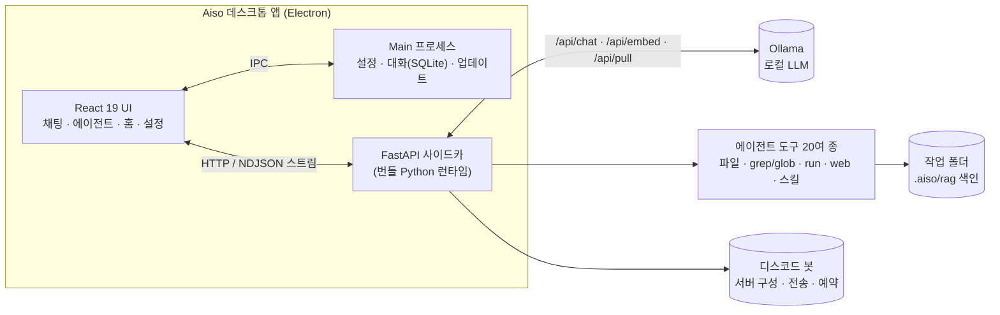

<div align="center">


# Aiso · 아이소

**내 컴퓨터 안에서 도는, 스스로 검증하는 로컬 AI 코딩·개발 에이전트**

<em>구독료 0원 · 인터넷 불필요 · 코드와 자료가 PC 밖으로 나가지 않는 100% 로컬 AI 개발 비서</em>

<br/>


[다운로드](#다운로드-및-설치) · [처음 설정](#처음-설정) · [사용법](#사용법) · [아키텍처](#아키텍처)

</div>

---

> **Aiso**(아이소, **AI + 다이소**)는 클라우드 AI의 구독 비용과 복잡한 사용법에 막히는 1인·소규모 크리에이터를 위한 **로컬 통합 AI 개발 데스크톱 앱**입니다.
> 구독해 빌려 쓰는 대신, 내 PC에 한 번 세팅하면 월 비용 없이 계속 씁니다. 한 줄 지시로 파일 정리부터 코드 작성·웹 제작까지 — **에이전트가 스스로 계획을 세우고, 파일을 다루고, 만든 결과물을 직접 실행해 검증**합니다.

<br/>

## 목차

- [Aiso란?](#aiso란)
- [주요 기능](#주요-기능)
- [다운로드 및 설치](#다운로드-및-설치)
- [처음 설정](#처음-설정)
- [사용법](#사용법)
- [아키텍처](#아키텍처)
- [기술 스택](#기술-스택)
- [소스에서 빌드](#소스에서-빌드)
- [로드맵](#로드맵)
- [프라이버시](#프라이버시)
- [라이선스 및 만든 사람](#라이선스-및-만든-사람)

<br/>

## Aiso란?

| | |
|---|---|
| **완전 로컬** | Ollama로 LLM을 내 PC에서 구동. 코드·문서가 외부 서버로 전송되지 않고, 이용료가 없습니다. |
| **진짜 에이전트** | 파일 읽기·쓰기·편집·삭제, 검색(glob·grep·RAG), 명령/웹 실행, 스킬 제작 등 **20여 개 도구**를 스스로 계획해 사용합니다(디스코드 봇 연결 시 서버 구성·전송·예약 도구도 추가). |
| **스스로 검증** | 만든 코드·웹을 직접 실행해 스크린샷·픽셀 변화로 확인 — "말로만 완성"을 걸러냅니다. |
| **설치 하나로 끝** | Python 런타임·C 툴체인이 앱에 번들되어 별도 개발환경 설치가 필요 없습니다. |
| **안전장치 내장** | 권한 3모드(수동/읽기/자동), 위험 작업 승인 요청, 삭제는 휴지통으로(복구 가능). |

<br/>

## 주요 기능

### 에이전트 하네스
- **20여 개 도구**(파일·검색·명령·웹·스킬)를 계획(plan) → 실행 → 검증 루프로 자율 수행
- **자가 검증** — `run_web`·`run_code`로 결과물을 실제 실행하고 스크린샷/픽셀 변화를 비교해 "에러는 없는데 동작하지 않는" 버그까지 탐지
- **승인 모드** — `수동`(모든 읽기·쓰기·삭제 승인) · `읽기`(쓰기·삭제만 승인) · `자동`(승인 없음)
- 계획 패널(To-do) · 실시간 진행 상황 · 답변별 토큰·소요시간 표시

### 웹 검색 (인터넷 조사)
- 모르는 최신 정보·사실을 **DuckDuckGo로 검색**하고 관련 문서 본문을 읽어 **여러 출처를 교차 확인**해 종합
- **채팅에서도 자동** — 채팅이 필요하다고 판단하면 **알아서** 인터넷을 조사해 답합니다(기본 켜짐 · 완전 로컬만 원하면 설정에서 끔)
- 지명·기관 같은 사실 질문은 기억에 의존하지 않고 **먼저 검색·원문 검증** — "아는 척"으로 인한 환각 억제
- **읽기 전용** — 페이지의 본문 텍스트만 가져오며 파일을 내려받거나 실행하지 않습니다(SSRF·DNS 리바인딩·다운로드 차단)

### RAG (문서 의미 검색)
- 임베딩 모델(`bge-m3`)로 작업 폴더를 색인해 관련 코드·문서를 **자동으로 문맥 주입**
- 채팅 모델과 독립 — 모델을 바꿔도 재색인 불필요
- 색인 범위(최대 파일 수) 설정 · 대용량 폴더 자동 상한 · 색인 자동 최신화

### 디스코드 봇 (팀 서버 · 알림 비서) — v0.2.0 신규
- **자연어 서버 구성** — "게임 개발팀 서버로 꾸며줘" 한 마디로 기획·아트·프로그래밍·QA 등 **직군별 카테고리와 채널을 설계·생성**. 이름 변경·이동·삭제까지 가능하며, 적용 전 **소유자 승인** 절차를 거칩니다(삭제는 복구 불가라 명시적 확인).
- **메시지 전송 · 예약** — 채널에 바로 보내거나, "매일 아침 8시에 공지방에 알림 보내"처럼 **1회·매일 예약**. 명령 채널은 자동 보호됩니다.
- **자동 브리핑** — 예약한 시각에 **웹을 조사해 내용을 그때 생성**해 전송(날씨·뉴스 브리핑 등).
- **거의 무설정** — 봇 토큰만 넣으면 소유자·전용 명령 채널·허용목록을 봇이 자동 처리. 허용 사용자는 디스코드 `/allow` 명령으로 관리.
- **백그라운드 상주** — 창을 닫아도 트레이에 남아 봇·예약이 계속 작동(로그인 시 자동 실행 선택 가능).
- 앱의 **에이전트 탭**과 디스코드 **#aiso 채널** 양쪽에서 자연어로 지시할 수 있습니다.

### 대화 · 생산성
- **다중 대화방** — 채팅·에이전트 각각 여러 대화를 만들고 오가기(고정·이름변경·우클릭 메뉴), `node:sqlite`로 영속화
- **GPU 즉시 비우기** — 다른 작업에 GPU가 급할 때, 설정에서 버튼 하나로 로드된 모델을 VRAM에서 즉시 내림
- **토큰 사용량 통계** — 홈에서 일·주·월 그래프
- **첫 설치 온보딩** — Ollama·채팅 모델·임베딩 모델 준비 상태를 감지해 **앱 안에서 원클릭 다운로드**
- **자동 업데이트** — GitHub 릴리스 기반(설치본에서 동작)

### 완성도
- **마크다운 렌더링** — 답변의 제목·굵게·목록·표·코드·링크를 서식으로 표시(링크는 기본 브라우저로 열림)
- 청강대학교 시그니처 **CK Orange(#F16522)** 브랜딩, 스프링 애니메이션
- 네이티브 대신 앱 내 커스텀 UI(확인창·툴팁·우클릭 메뉴)로 일관된 경험

<br/>

## 다운로드 및 설치

### 시스템 요구사항
| 항목 | 최소 | 권장 |
|---|---|---|
| OS | Windows 10 64-bit | Windows 11 64-bit |
| RAM | 16 GB | 32 GB |
| GPU | NVIDIA VRAM 8 GB 이상 | NVIDIA VRAM 16 GB |
| 필수 | [Ollama](https://ollama.com/download) 설치 | — |

### 설치 단계
1. [Releases](https://github.com/devbin-lab/AISO/releases/latest) 페이지에서 **`Aiso-0.2.1-Setup.exe`** 다운로드
2. 설치 파일 실행 → 설치 경로 선택 후 설치
3. Aiso 실행

> **주의 — SmartScreen 안내**
> 현재 설치본은 코드 서명이 없어 처음 실행 시 "Windows의 PC 보호" 경고가 뜰 수 있습니다.
> **추가 정보 → 실행**을 눌러 진행하세요. (오픈소스이며, 소스는 이 저장소에 공개되어 있습니다.)

<br/>

## 처음 설정

Aiso는 **모델을 함께 배포하지 않습니다.** LLM은 각자 PC에서 Ollama로 받아 쓰므로, 아래 3단계만 하면 됩니다.

### 1. Ollama 설치·실행
- [ollama.com/download](https://ollama.com/download) 에서 설치 → 실행하면 백그라운드에서 대기합니다.

### 2. 모델 다운로드 — 앱 안에서 원클릭 (권장)
Aiso를 켜면 **홈 화면의 "시작 준비" 카드**가 준비 상태를 안내합니다.

- **채팅 모델** — 추천 목록에서 원하는 모델을 골라 `설치` 버튼 클릭
  - `gemma4:12b` (기본 추천 · 16GB PC에 적합) · `gpt-oss:20b` · `deepseek-r1:14b` · `qwen3.5:9b` · `exaone3.5:7.8b`(한국어)
- **임베딩 모델** — RAG 검색용 `bge-m3`를 `설치` 버튼으로 원클릭 다운로드

> 터미널을 선호한다면 직접 받아도 됩니다:
> ```bash
> ollama pull gemma4:12b      # 채팅 모델
> ollama pull bge-m3          # RAG 임베딩 모델
> ```

### 3. 모델 선택 → 바로 사용
- **설정 탭**에서 설치한 채팅 모델을 선택합니다.
- **에이전트 탭**에서 **작업 폴더**를 지정하면, 그 폴더 안에서만 파일 작업이 이뤄집니다(안전).
- 이제 한 줄 지시로 시작하세요. 예: *"이 폴더의 파일들을 종류별로 정리해줘"*, *"간단한 웹 게임을 만들고 실행해서 확인해줘"*

<br/>

## 사용법

| 탭 | 용도 |
|---|---|
| **홈** | 시스템·모델 상태, 첫 설치 온보딩, 토큰 사용량 통계 |
| **채팅** | 로컬 모델과의 일반 대화 · 필요할 때 **자동으로** 인터넷 조사(설정에서 끔 가능) |
| **에이전트** | 작업 폴더 안에서 파일을 직접 다루는 자율 에이전트 · (봇 연결 시) 디스코드 서버 구성·전송·예약 |
| **설정** | 모델·추론 강도·온도·검색·RAG·리소스(GPU 언로드)·디스코드 봇·업데이트 등 |

**에이전트 팁**
- 위험한 작업(쓰기·삭제·명령 실행)은 **권한 모드**에 따라 승인 요청이 뜹니다. 처음엔 `읽기` 모드를 권장합니다.
- 작은 로컬 모델은 **한 번에 하나의 명확한 작업**을 시킬 때 가장 안정적입니다. 복잡한 작업은 단계로 나눠 지시하세요.
- 삭제는 **휴지통**으로 이동해 복구할 수 있습니다.

<br/>

## 아키텍처



- **UI(렌더러)** ↔ **Main** — 설정·대화·창 제어는 IPC로. 대화는 `node:sqlite`(내장)로 원자적 저장.
- **UI** ↔ **Python 사이드카** — 채팅·에이전트·RAG·모델 다운로드는 NDJSON 스트리밍.
- **사이드카** ↔ **Ollama** — 실제 LLM 추론·임베딩·모델 pull.
- 파일 작업은 사용자가 지정한 **작업 폴더 안으로만** 제한됩니다(경로 탈출 차단).

<br/>

## 기술 스택

| 영역 | 사용 기술 |
|---|---|
| **데스크톱** | Electron 43 · electron-vite · electron-updater |
| **프론트엔드** | React 19 · TypeScript |
| **백엔드(사이드카)** | Python · FastAPI · httpx (번들 임베디드 Python) |
| **LLM 런타임** | Ollama (`gemma4`·`gpt-oss` 등) · `bge-m3` 임베딩 |
| **검색(RAG)** | NumPy 코사인 인덱스 (모델 독립) |
| **저장** | `node:sqlite`(대화) · JSON(설정·사용량) |
| **번들** | 임베디드 Python 런타임 · w64devkit C/C++ 툴체인 |
| **패키징** | electron-builder (NSIS) · GitHub Releases 배포 |

<br/>

## 소스에서 빌드

```bash
# 사전 요구: Node.js 20+, Python 3.12, Ollama

git clone https://github.com/devbin-lab/AISO.git
cd AISO
npm install

# Python 사이드카 가상환경 (python/.venv)
python -m venv python/.venv
python/.venv/Scripts/pip install -r python/requirements.txt

npm run dev          # 개발 실행 (Electron + Vite HMR)
npm run typecheck    # 타입 검사
npm run dist:win     # Windows 설치본 빌드 → dist/Aiso-<ver>-Setup.exe
```

> 배포 빌드는 임베디드 Python 런타임(`build:pyruntime`)과 C 툴체인을 함께 번들합니다.

<br/>

## 로드맵

- [x] **1차 — 에이전트 코어 (완료)**
  로컬 LLM 코딩 에이전트 MVP · 자가 검증 · RAG · 웹 검색(에이전트·채팅) · 스킬 시스템 · 마크다운 렌더링 · 다중 대화방 · 첫 설치 온보딩 · 자동 업데이트
- [x] **2차 — 디스코드 통합 (v0.2.0 완료)**
  자연어 서버 구성(팀 채널 자동 개설) · 메시지 전송 · 예약 · 자동 브리핑 · 백그라운드 트레이 상주 · GPU 즉시 언로드
- [ ] **3차 — 확장**
  ComfyUI 이미지 생성 에이전트 · 앱을 끄고도 도는 완전 상주(스케줄러)
- [ ] **4차 — 통합 비서 에이전트**

<br/>

## 프라이버시

- **모든 추론이 로컬에서** 이뤄집니다. 대화·코드·문서가 외부 서버로 전송되지 않습니다.
- 사용자 데이터(설정·대화·사용량·RAG 색인)는 **내 PC에만** 저장되며 설치본에 포함되지 않습니다.
- 유일한 외부 통신은 (1) 사용자가 직접 실행하는 Ollama 모델 다운로드, (2) 앱 자동 업데이트 확인(GitHub Releases)뿐입니다.

<br/>

## 라이선스 및 만든 사람

- **만든 사람** — 김성빈 ([@devbin-lab](https://github.com/devbin-lab)) · 청강문화산업대학교 게임콘텐츠스쿨
- **출품** — 2026 청강 AI 크리에이티브 부스트 공모전
- **라이선스** — [Apache-2.0](LICENSE)
- **감사** — [Ollama](https://ollama.com) · [Electron](https://www.electronjs.org) · [FastAPI](https://fastapi.tiangolo.com) · [gemma](https://ai.google.dev/gemma) · [bge-m3](https://huggingface.co/BAAI/bge-m3)

<div align="center">
<br/>
<sub>Aiso — <b>내 컴퓨터 안의 AI 개발 비서</b>. 구독 없이, 인터넷 없이, 내 PC에서.</sub>
</div>
