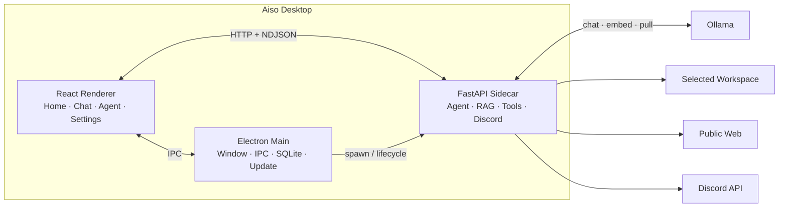

<div align="center">


# Aiso

**작은 로컬 모델에 맞춰 설계한 작업·조사·자동화 에이전트**

파일과 문서를 내 PC에서 다루고, 필요한 작업은 실행 결과로 확인합니다.


[다운로드](#다운로드) · [시작하기](#시작하기) · [사용 범위](#사용-범위) · [아키텍처](#아키텍처) · [버전 변천사](#버전-변천사)

</div>

---

## 프로젝트 소개

Aiso는 Ollama 기반의 소형 언어 모델을 활용하는 Windows 데스크톱 에이전트입니다. 대화만 제공하는 챗봇을 넘어, 사용자가 지정한 작업 폴더를 탐색하고 파일을 정리하며 문서를 분석하고 반복 작업을 자동화합니다.

이 프로젝트는 로컬에서 구동할 수 있는 9B~20B급 모델의 장점과 한계를 함께 고려해 설계했습니다. 작은 모델에 대규모 프로그램의 설계와 수정을 맡기지 않습니다. 대신 범위를 명확히 제한하고, 파일 시스템·검색·실행·웹 브라우저 같은 결정적 도구를 연결해 다음 작업에 집중합니다.

- 파일과 폴더의 탐색, 분류, 이동 및 정리
- PDF·Excel·Word를 포함한 문서 내용 분석
- Markdown 문서 작성 및 편집
- 기존 코드와 웹 결과물의 간단한 실행·검사·검증
- 최신 정보 검색과 여러 출처의 교차 확인
- 반복 작업을 위한 Python 스킬 생성 및 실행
- Discord 서버 구성, 메시지 전송 및 예약 브리핑

핵심 목표는 모델의 능력을 과장하는 것이 아니라, **로컬 모델이 안정적으로 수행할 수 있는 범위를 제품 수준의 안전장치와 검증 절차로 제공하는 것**입니다.

## 설계 원칙

### 로컬 우선

LLM 추론과 임베딩은 사용자가 선택한 Ollama 서버에서 수행합니다. 기본 설정은 `http://localhost:11434`이며, 대화 기록·설정·사용량·RAG 색인은 사용자 PC에 저장됩니다.

웹 검색, 모델 다운로드, 업데이트 확인, Discord 연동처럼 외부 연결이 필요한 기능은 해당 기능을 사용할 때만 네트워크를 사용합니다. 웹 검색은 설정에서 비활성화할 수 있고 Discord 연동은 기본적으로 꺼져 있습니다.

### 명확한 역할 제한

Aiso는 범용 코딩 에이전트가 아닙니다. 사용자의 프로그램이나 애플리케이션 코드를 새로 작성하거나 직접 수정하지 않으며, 일반 파일 쓰기·편집은 Markdown 문서로 제한합니다.

코드 실행 도구는 다음과 같은 검증 목적으로 사용합니다.

- 기존 코드의 실행 가능 여부 확인
- 문법 오류와 기본적인 런타임 오류 검사
- 기존 웹 페이지의 렌더링과 상호작용 확인
- 자동화 스킬이 실제로 동작하는지 검증

반복 자동화가 필요한 경우에만 앱 전용 스킬 폴더에 독립적인 Python 스킬을 생성합니다. 스킬 실행은 임의 코드 실행에 해당하므로 권한 모드에 따라 사용자 승인을 요구합니다.

### 도구 기반 검증

에이전트는 결과를 추측으로 확정하지 않습니다. 파일을 다시 읽고, 명령을 실행하고, 브라우저 화면과 픽셀 변화를 확인하는 방식으로 가능한 범위 안에서 결과를 검증합니다. 검증에 실패하면 오류를 모델에 다시 전달해 작업을 수정하거나 한계를 명확하게 보고합니다.

### 사용자 통제

파일 변경, 명령 실행, 외부 서비스 변경은 권한 정책을 거칩니다. 특히 Discord 메시지 전송·예약·서버 변경은 자동 모드에서도 최종 승인을 요구합니다.

## 주요 기능

### 작업 폴더 에이전트

- 계획 수립, 도구 실행, 결과 확인으로 이어지는 다단계 작업 루프
- 폴더 구조 조회, 파일명 검색, 본문 검색, 파일 읽기
- 파일 및 폴더 생성·이동·이름 변경·삭제
- PDF, `.xlsx`, `.docx` 등 문서 형식의 텍스트 추출
- 작업 폴더 밖으로의 경로 이탈 차단
- 진행 계획, 도구 호출 결과, 토큰 사용량, 소요 시간 표시

### 검사 및 검증

- Python, C, C++, C# 기존 코드의 실행·검사
- 기존 HTML 결과물 실행 및 브라우저 상호작용
- 렌더링 스크린샷과 화면 변화 확인
- 명령별 타임아웃과 반복 호출 감지
- 파일 변경 후 RAG 색인 자동 갱신

검증 도구는 기존 결과물을 확인하기 위한 기능입니다. 새로운 프로그램을 제작하거나 프로젝트 전반을 자율 수정하는 기능은 제공하지 않습니다.

### 웹 조사

- DuckDuckGo 기반 웹 검색
- 관련 페이지의 읽을 수 있는 본문 수집
- 복수 출처 확인 후 답변 종합
- 채팅 중 필요할 때 자동 검색하는 리서치 모드
- 사설망·localhost·내부 주소 접근 차단
- 페이지의 서브리소스 요청과 다운로드 제한

웹에서 가져온 내용은 외부 자료로 취급하며, 파일로 내려받거나 실행하지 않습니다.

### 문서 의미 검색

- `bge-m3` 임베딩 기반 작업 폴더 색인
- 질문과 관련된 문서 조각 자동 검색
- 채팅 모델과 독립된 임베딩 색인
- 색인할 최대 파일 수와 검색 결과 수 설정
- NumPy 코사인 유사도 기반 로컬 인덱스

### 자동화 스킬

- 재사용 가능한 Python 스킬 생성
- 스킬 이름·설명·실행 코드를 앱 전용 폴더에 저장
- JSON 입력과 표준출력 기반의 단순한 실행 규약
- 생성 직후 실제 실행을 통한 동작 확인
- 설정 화면에서 스킬 목록 확인 및 삭제

스킬은 알림, 브리핑, 정보 수집처럼 반복해서 실행할 작은 자동화 작업에 적합합니다.

### Discord 연동

- 자연어 기반 카테고리·채널 구성
- 현재 서버 구조 조회 및 변경 계획 미리보기
- 채널 메시지 전송
- 1회 또는 매일 반복 예약
- 예약 시점에 웹을 조사해 내용을 생성하는 브리핑
- 소유자와 허용 사용자 중심의 접근 제어
- 보호된 전용 명령 채널
- 트레이 상주 및 Windows 로그인 시 자동 실행

Discord 봇 토큰은 Electron `safeStorage`를 사용해 별도로 보관합니다. 서버 변경, 발신, 예약 등록은 적용 전에 승인을 받습니다.

### 데스크톱 기능

- 채팅과 에이전트 대화의 다중 대화방
- SQLite 기반 대화 기록 저장
- 대화 고정, 이름 변경, 삭제
- 모델 설치 상태 확인과 Ollama 모델 다운로드
- 모델의 GPU 메모리 즉시 해제
- 일·주·월 토큰 사용량 통계
- GitHub Releases 기반 자동 업데이트
- 백엔드 비정상 종료 시 제한된 횟수의 자동 재시작

## 사용 범위

| 적합한 작업 | 제공하지 않는 작업 |
|---|---|
| 폴더 안의 파일을 종류별로 분류 | 새로운 애플리케이션 전체 구현 |
| 문서 묶음을 읽고 Markdown 보고서 작성 | 기존 프로그램 코드의 직접 수정 |
| 기존 코드의 기본 실행 오류 확인 | 대규모 리팩터링과 아키텍처 변경 |
| 기존 웹 페이지가 열리고 반응하는지 검사 | 프로덕션 코드 품질 보증 |
| 최신 자료를 검색하고 출처별로 정리 | 전문가 검토를 대체하는 최종 판단 |
| 반복 작업을 작은 스킬로 자동화 | 승인 없는 외부 서비스 변경과 발신 |

추천 요청 예시는 다음과 같습니다.

```text
이 폴더의 파일을 종류별로 분류하고, 이동 결과를 다시 확인해줘.

회의 자료를 읽고 핵심 결정 사항을 summary.md로 정리해줘.

이 Python 파일을 실행해서 발생하는 오류와 원인만 분석해줘.

공식 문서를 포함해 세 곳 이상 조사하고 차이점을 표로 정리해줘.

매일 아침 날씨를 확인하는 브리핑 스킬을 만들고 실행해줘.
```

작은 로컬 모델은 한 번에 하나의 명확한 목표를 전달할 때 가장 안정적입니다. 복합 작업은 독립적인 단계로 나눠 요청하는 것을 권장합니다.

## 화면 구성

| 화면 | 설명 |
|---|---|
| 홈 | 백엔드·Ollama·모델 상태, 초기 설정 안내, 토큰 사용량 확인 |
| 채팅 | 로컬 모델과 일반 대화, 선택적으로 자동 웹 조사 수행 |
| 에이전트 | 작업 폴더 지정, 권한 모드 선택, 계획·도구 기반 작업 수행 |
| 설정 | 모델, 추론 강도, 온도, 컨텍스트, RAG, 웹 검색, Discord, 업데이트 관리 |

## 안전 및 보안

### 권한 모드

| 모드 | 동작 |
|---|---|
| 수동 | 읽기, 쓰기, 이동, 삭제, 실행을 포함한 모든 실질 작업에 승인 필요 |
| 읽기 | 조회 작업은 자동으로 수행하고 쓰기·편집·삭제·명령 실행은 승인 필요 |
| 자동 | 작업 폴더 안의 작업을 승인 없이 수행. 외부 발신과 Discord 변경은 예외적으로 승인 필요 |

처음 사용할 때는 `읽기` 모드를 권장합니다.

### 보호 장치

- 에이전트의 파일 접근을 사용자가 지정한 작업 폴더로 제한
- 사용자 홈 디렉터리 자체를 작업 폴더로 지정하는 동작 차단
- 삭제 작업은 가능한 경우 운영체제 휴지통으로 이동
- FastAPI 사이드카를 `127.0.0.1`의 동적 포트에서 실행
- 앱 실행마다 생성한 세션 토큰으로 사이드카 API 인증
- 허용된 개발 오리진만 접근할 수 있도록 CORS 제한
- 웹 가져오기 과정의 SSRF, DNS 리바인딩, 사설망 접근 차단
- 미리보기 페이지에 CSP와 iframe sandbox 적용
- 명령·웹 실행 시간 제한과 에이전트 반복 퇴행 감지
- 스킬 실행 환경에서 Aiso 인증 토큰 제거

자동 모드는 사용자의 확인 단계를 줄이는 대신 파일 변경과 명령 실행 위험을 수반합니다. 신뢰할 수 있는 작업 폴더에서만 사용해야 합니다.

## 다운로드

최신 Windows 설치본은 [GitHub Releases](https://github.com/devbin-lab/AISO/releases/latest)에서 받을 수 있습니다.

현재 버전: `0.2.1`

설치 파일:

```text
Aiso-0.2.1-Setup.exe
```

### 시스템 요구사항

| 항목 | 최소 | 권장 |
|---|---|---|
| 운영체제 | Windows 10 64-bit | Windows 11 64-bit |
| 메모리 | 16 GB | 32 GB |
| GPU | NVIDIA GPU, VRAM 8 GB | NVIDIA GPU, VRAM 16 GB 이상 |
| 필수 프로그램 | [Ollama](https://ollama.com/download) | 최신 안정 버전 |

선택한 모델과 컨텍스트 길이에 따라 실제 메모리 요구량은 달라집니다. GPU 메모리가 부족하면 더 작은 모델을 사용하거나 컨텍스트 길이를 낮춰야 합니다.

> 현재 설치 파일에는 코드 서명이 적용되어 있지 않습니다. Windows SmartScreen 경고가 표시될 경우 게시자와 파일 출처를 확인한 후 실행하십시오.

## 시작하기

### 1. Ollama 설치

[Ollama 공식 사이트](https://ollama.com/download)에서 Windows 버전을 설치하고 실행합니다.

### 2. 모델 준비

Aiso의 홈 화면에서 설치된 모델을 확인하고 필요한 모델을 내려받을 수 있습니다. 기본 설정은 다음과 같습니다.

- 채팅 모델: `gemma4:12b`
- 임베딩 모델: `bge-m3`
- 컨텍스트 길이: `16384`
- 모델 유지 시간: `30m`

앱에서 선택할 수 있는 대표 모델은 다음과 같습니다.

| 모델 | 성격 |
|---|---|
| `gemma4:12b` | 기본 추천, 성능과 자원 사용량의 균형 |
| `gpt-oss:20b` | 상대적으로 높은 추론 성능, 더 많은 VRAM 필요 |
| `deepseek-r1:14b` | 추론 중심 작업 |
| `qwen3.5:9b` | 경량·다국어 작업 |
| `exaone3.5:7.8b` | 경량·한국어 작업 |

터미널에서 직접 설치하려면 다음 명령을 사용할 수 있습니다.

```powershell
ollama pull gemma4:12b
ollama pull bge-m3
```

### 3. 작업 폴더와 권한 설정

에이전트 화면에서 작업 폴더를 선택하고 권한 모드를 지정합니다. 파일 관련 도구는 선택한 폴더 안에서만 활성화됩니다. 작업 폴더를 선택하지 않아도 일반 채팅, 웹 조사, 스킬, Discord 기능은 사용할 수 있습니다.

### 4. 선택 기능 설정

- 완전한 오프라인 사용이 필요하면 채팅 웹 검색을 끕니다.
- 문서 의미 검색이 필요하면 `bge-m3`를 설치하고 RAG를 활성화합니다.
- Discord 기능이 필요하면 봇 토큰을 저장하고 연동을 활성화합니다.
- 예약과 봇을 창을 닫은 뒤에도 유지하려면 트레이 상주를 켭니다.

## 아키텍처



### 구성 요소

| 경로 | 역할 |
|---|---|
| `src/renderer` | React 기반 사용자 인터페이스 |
| `src/main` | Electron 메인 프로세스, 창·IPC·저장소·업데이트·사이드카 관리 |
| `src/preload` | 렌더러에 허용된 API만 노출하는 preload 계층 |
| `src/shared` | 메인·렌더러가 공유하는 타입과 계약 |
| `python/main.py` | FastAPI 엔드포인트와 사이드카 진입점 |
| `python/agent.py` | 에이전트 루프, 모델 호출, 계획·승인·반복 감지 |
| `python/toolspec.py` | 도구 스키마, 실행 방식, 승인 등급의 통합 레지스트리 |
| `python/tools.py` | 작업 폴더 기반 파일 시스템 도구 |
| `python/rag.py` | 문서 색인, 임베딩, 의미 검색 |
| `python/websearch.py`, `python/webfetch.py` | 웹 검색과 안전한 본문 수집 |
| `python/runskill.py` | 자동화 스킬 생성 및 실행 |
| `python/discord*.py` | Discord 봇, 서버 작업, 예약 관리 |
| `pyruntime` | 설치본에 포함되는 Python 런타임 |
| `tools` | 검증에 사용하는 Windows 도구 체인 |

Electron 메인 프로세스는 실행 시 사용 가능한 로컬 포트를 확보하고 Python FastAPI 사이드카를 시작합니다. 렌더러는 preload 계층을 통한 IPC와 인증 토큰이 포함된 HTTP 요청만 사용합니다. 실제 LLM 추론과 임베딩은 FastAPI 사이드카가 Ollama API를 호출해 수행합니다.

## 기술 스택

| 영역 | 기술 |
|---|---|
| 데스크톱 | Electron 43, electron-vite, electron-updater |
| 프론트엔드 | React 19, TypeScript 6, Vite |
| 백엔드 | Python 3.12, FastAPI, Uvicorn, httpx |
| 로컬 AI | Ollama, `gemma4`, `gpt-oss`, `bge-m3` |
| 문서 처리 | pypdf, openpyxl, python-docx, olefile |
| 웹 검증 | Playwright |
| Discord | discord.py |
| 저장소 | Node.js SQLite, JSON, NumPy 인덱스 |
| 패키징 | electron-builder, NSIS, 임베디드 Python 런타임 |

## 개발 및 빌드

### 요구 환경

- Node.js 20 이상
- Python 3.12
- Ollama
- Windows PowerShell

### 개발 환경 구성

```powershell
git clone https://github.com/devbin-lab/AISO.git
cd AISO

npm install

python -m venv python/.venv
python/.venv/Scripts/python.exe -m pip install -r python/requirements.txt
python/.venv/Scripts/python.exe -m pip install -r python/requirements-dev.txt
```

### 주요 명령

```powershell
npm run dev          # Electron과 Vite 개발 서버 실행
npm run typecheck    # Main, preload, renderer 타입 검사
npm run build        # Electron 애플리케이션 빌드
npm run dist:win     # Python 런타임을 포함한 Windows 설치본 생성

python/.venv/Scripts/python.exe -m pytest python/tests -q
```

배포 빌드는 `python` 소스, 임베디드 Python 런타임, 검증용 도구 체인을 Electron 리소스에 포함합니다. 일부 네트워크·디버깅 실행 파일은 바이러스 백신 오탐을 줄이기 위해 배포 대상에서 제외합니다.

## 현재 제약사항

- Windows 10/11만 공식 대상으로 합니다.
- Ollama는 별도로 설치해야 하며 모델 파일은 설치 프로그램에 포함하지 않습니다.
- 결과 품질과 도구 호출 안정성은 선택한 모델에 영향을 받습니다.
- 코드 실행은 제한된 검증 기능이며 완전한 보안 샌드박스가 아닙니다.
- 자동 모드에서는 작업 폴더 내부 파일을 사용자 확인 없이 변경할 수 있습니다.
- Discord 예약은 Aiso 백엔드가 실행 중일 때만 처리됩니다.
- ComfyUI 이미지 생성은 아직 구현되어 있지 않습니다.
- `.xls` 같은 일부 구형 문서 형식은 직접 지원하지 않습니다.

## 데이터와 네트워크

### 로컬에 저장되는 데이터

- 애플리케이션 설정
- 채팅 및 에이전트 대화 기록
- 토큰 사용량 통계
- 작업 폴더별 RAG 색인
- 사용자가 만든 자동화 스킬
- Discord 설정과 예약 정보

### 외부 연결이 발생하는 경우

| 기능 | 연결 대상 | 비고 |
|---|---|---|
| LLM 추론·임베딩 | 설정된 Ollama 호스트 | 기본값은 localhost |
| 모델 설치 | Ollama 모델 저장소 | 사용자가 설치를 실행할 때 |
| 웹 조사 | DuckDuckGo 및 선택한 공개 웹 페이지 | 웹 검색이 활성화된 경우 |
| Discord | Discord API | 연동을 활성화한 경우 |
| 업데이트 | GitHub Releases | 설치본의 업데이트 확인 시 |

Aiso는 공개 웹 페이지를 읽을 때 내부 네트워크 주소와 로컬 서비스를 차단합니다. 다만 외부 서비스 기능을 활성화하면 요청 내용이나 생성된 메시지가 해당 서비스로 전송될 수 있으므로 사용 전에 기능별 동작을 확인해야 합니다.

## 프로젝트 정보

- 개발: 김성빈 ([devbin-lab](https://github.com/devbin-lab))
- 소속: 청강문화산업대학교 게임콘텐츠스쿨
- 출품: 2026 청강 AI 크리에이티브 부스트 공모전
- 라이선스 메타데이터: Apache-2.0

## 버전 변천사

아래 기록은 저장소에 남아 있는 Git 릴리스 태그를 기준으로 정리했습니다.

### v0.2.1 — 2026-07-18

안정화와 배포 품질에 집중한 버그 수정 릴리스입니다.

- 적대적 검증 과정에서 확인된 주요 결함 수정
- Python 사이드카 비정상 종료 후 자동 재시작 안정화
- Discord 작업과 예약 처리 안정성 개선
- 번들 도구 체인의 BusyBox 관련 회귀 수정
- 바이러스 백신 오탐 가능성이 높은 불필요 실행 파일 제외

### v0.2.0 — 2026-07-17

개인용 로컬 에이전트에서 팀 커뮤니케이션 자동화 도구로 범위를 확장했습니다.

- Discord 봇 연동
- 자연어 기반 서버 카테고리·채널 구성
- 메시지 전송과 1회·매일 예약
- 웹 조사 기반 자동 브리핑
- 봇 소유자 승인 및 허용 사용자 관리
- 트레이 백그라운드 상주와 Windows 자동 실행
- 설정 화면에서 GPU 모델 즉시 언로드

### v0.1.4 — 2026-07-15

현재의 역할 제한과 재사용 자동화 구조를 확립한 릴리스입니다.

- 프로그램 코드 작성 대신 파일 관리·조사·문서화 중심으로 에이전트 역할 재정의
- Python 자동화 스킬 생성·실행 시스템 추가
- 작업 폴더 없이 웹 조사와 스킬 기능 사용 가능
- DuckDuckGo 검색과 공개 웹 페이지 본문 수집
- 채팅 중 자동 웹 조사와 복수 출처 확인
- Markdown 답변 렌더링
- 사이드카 토큰 인증, CORS, CSP, SSRF 방어 강화
- 장시간 웹 검증 및 반복 추론의 무한 대기 차단

### v0.1.3 — 2026-07-12

제품의 시각적 정체성과 배포 문서를 정비했습니다.

- Aiso 애플리케이션 아이콘 추가
- 로고와 브랜드 스타일 반영
- README와 설치 안내 개선

### v0.1.2 — 2026-07-10

초기 사용 경험과 대화 관리 기능을 개선했습니다.

- 채팅 및 에이전트 다중 대화방
- 대화 기록을 SQLite로 이전
- 수동·읽기·자동 권한 모드 정립
- 첫 실행 온보딩과 모델 준비 상태 안내
- 앱 내 Ollama 모델 다운로드
- 개발자 모드와 초기화 도구 추가

### v0.1.0 — 2026-07-09

Aiso의 첫 실행 가능한 Windows 릴리스입니다.

- Electron과 React 기반 데스크톱 셸
- FastAPI Python 사이드카
- Ollama 로컬 채팅과 스트리밍 응답
- 작업 폴더 기반 파일 도구와 초기 에이전트 루프
- RAG 색인과 기본 검증 도구
- 임베디드 Python 런타임 번들
- NSIS 기반 Windows 설치 프로그램
