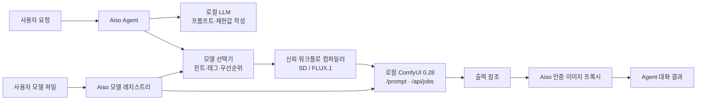

# Aiso v0.3.0 ComfyUI 연동 개발 설계·정적 테스트 체크리스트

> 문서 버전: 0.3.0
>
> 기준일: 2026-07-20
>
> 작업 브랜치: `codex/comfyui-v0.3.0`
>
> 현재 판정: **정적 구현, Agent→ComfyUI 실이미지·후속 대화, Windows 설치 패키지·패키징 사이드카 동적 검증 완료 / 취소·OOM·반복 VRAM 시험 잔여**

## 1. 목표

사용자가 직접 준비한 ComfyUI 모델을 Aiso에 등록하면, Agent가 사용자의 이미지 요청과 모델 프로필을 비교해 적절한 모델을 선택하고 Aiso가 소유한 신뢰 워크플로를 실행한다. 생성 결과는 인증된 Aiso 경로를 통해 Agent 대화에 표시한다.

핵심 원칙은 다음과 같다.

- Aiso는 모델을 번들·배포·자동 다운로드·공식 추천하지 않는다.
- 모델 다운로드와 라이선스 확인은 사용자가 수행한다.
- Aiso는 사용자가 선택한 `.safetensors` 파일만 ComfyUI의 정해진 모델 폴더로 복사·등록한다.
- LLM은 프롬프트·모델 힌트와 사용자가 명시한 크기·seed만 작성한다. Steps·CFG·sampler·scheduler와 ComfyUI 노드 종류·연결·파일 경로는 작성할 수 없다.
- 워크플로 그래프는 Aiso의 결정론적 컴파일러가 지원 템플릿으로만 만든다.
- Aiso가 제출한 UUID 작업만 조회·취소한다. 전역 `/interrupt`는 사용하지 않는다.

## 2. 지원 범위

| 항목 | v0.3.0 범위 |
|---|---|
| 수동 사용 | Aiso 내부에서 로컬 ComfyUI 원본 UI 표시 |
| 모델 보관 | 사용자 ComfyUI 설치본의 `ComfyUI/models` |
| 모델 등록 | 다중 프로필, 자산 슬롯, 태그, 우선순위, Agent 사용 여부 |
| 파일 형식 | `.safetensors`만 허용 |
| Agent 자동 생성 | SD 1.5·SDXL 체크포인트, FLUX.1 split |
| 모델 선택 | 명시한 모델 힌트 → 요청/태그 일치 → 우선순위 |
| 결과 | Agent 대화 내 미리보기·메타데이터·다운로드 |
| 추가 VAE·LoRA·ControlNet 등 | 파일 등록 가능, 해당 기본 템플릿의 필수 슬롯이 아니면 미적용 |
| FLUX.2·custom | 목록 관리 가능, Agent 자동 워크플로는 미지원 |
| img2img·inpaint | 후속 버전 |
| 임의 노드·커스텀 노드 | 미지원 |
| 원격·Cloud ComfyUI | 미지원, 정확한 loopback 주소만 허용 |

## 3. 전체 구조



경계 조건:

- Renderer와 LLM에는 절대 모델 원본 경로나 워크플로 그래프 입력 권한을 주지 않는다.
- Renderer는 Electron IPC로 모델 프로필만 관리한다.
- FastAPI는 인증 토큰을 요구하고 ComfyUI 주소를 `127.0.0.1` 또는 `localhost`의 명시적 HTTP 주소로 제한한다.
- ComfyUI 결과는 파일명·하위 폴더·저장 유형을 검증한 뒤 PNG/JPEG/WebP, 최대 50 MiB만 중계한다.

## 4. 모델 프로필 계약

### 4.1 공통 필드

- `id`: Aiso 내부 UUID
- `name`: 사용자 표시 이름
- `family`: `sd15 | sdxl | flux1 | flux2 | custom`
- `tags`: Agent 모델 선택용 특성 태그
- `agentEnabled`: 자동 선택 허용 여부
- `priority`: 같은 조건에서의 선택 우선순위
- `defaults`: width, height, steps, CFG, sampler, scheduler
- `assets`: ComfyUI 상대 이름, 크기, SHA-256, 자산 종류와 슬롯

### 4.2 필수 자산

| 모델 계열 | 필수 슬롯 | 자동 생성 |
|---|---|---|
| SD 1.5 | `checkpoint` | 지원 |
| SDXL | `checkpoint` | 지원 |
| FLUX.1 split | `diffusion_model`, `clip_l`, `t5xxl`, `vae` | 지원 |
| FLUX.2 | 프로필별 | 미지원 |
| custom | 프로필별 | 미지원 |

### 4.3 생성값 제한

| 값 | 제한 |
|---|---|
| width / height | 256~2048, 64의 배수 |
| steps | 1~60 |
| CFG | 0~30 |
| seed | 0~2⁶⁴-1, UI 왕복 시 문자열로 보존 |
| prompt / negative prompt | 각각 최대 4,000자 |
| sampler | `euler`, `euler_ancestral`, `dpmpp_2m`, `dpmpp_2m_sde` |
| scheduler | `normal`, `karras`, `simple`, `beta` |

### 4.4 모델별 프롬프트 정책

- 모델별 정책은 LLM의 추측이 아니라 Aiso의 검증된 정책 카탈로그가 적용한다.
- Animagine XL 4.0/Opt 정책은 SDXL 계열을 먼저 확인하고 공식 체크포인트 SHA-256이 일치할 때만 활성화한다. 사용자 선택용 자유 태그, 프로필 표시 이름, 체크포인트 파일명은 모델 정체성 증거로 사용하지 않는다.
- Agent는 정책 힌트에 따라 영어 쉼표 구분 태그를 작성하고, Aiso는 공식 quality suffix와 negative prompt를 중복 없이 결정론적으로 병합한다.
- 여러 Agent 모델 프로필이 등록되면 사용자가 이름·ID로 지목한 프로필에만 전용 정책 힌트를 노출한다. 프로필이 하나뿐인 경우에만 그 단일 정책을 자동 안내한다.
- 결과에는 원본 프롬프트, 실제 제출 프롬프트, 적용 정책 ID·식별 근거·자동 추가 태그를 함께 기록한다.
- 정책 근거: [Cagliostro Research Lab의 Animagine XL 4.0 공식 모델 카드](https://huggingface.co/cagliostrolab/animagine-xl-4.0)

## 5. 신뢰 워크플로

### 5.1 SD 1.5·SDXL 체크포인트

```text
CheckpointLoaderSimple
 ├─ CLIPTextEncode (positive)
 ├─ CLIPTextEncode (negative)
 └─ MODEL
EmptyLatentImage
→ KSampler
→ VAEDecode
→ SaveImage
```

### 5.2 FLUX.1 split

```text
UNETLoader + DualCLIPLoader + VAELoader
→ CLIPTextEncode
→ FluxGuidance
→ BasicGuider
RandomNoise + BasicScheduler + KSamplerSelect
→ SamplerCustomAdvanced
→ VAEDecode
→ SaveImage
```

체크 항목:

- [x] 허용된 코어 노드의 class type과 Python module 계약을 서버 `object_info`와 비교한다.
- [x] 서버가 실제 노출한 모델·sampler·scheduler 값과 정확히 일치하는지 제출 전에 확인한다.
- [x] LLM·Renderer가 `class_type`, 노드 ID, 연결 그래프를 전달할 수 없다.
- [x] 프로필의 추가 자산은 보존하되, 템플릿별 필수 슬롯이 아니면 기본 그래프에 자동 삽입하지 않는다.
- [x] FLUX.1 기본 템플릿은 negative prompt를 적용하지 않으며 결과 설명에 이를 표시한다.

## 6. 기능 구현 체크리스트

### 6.1 ComfyUI 화면과 실행

- [x] 사이드바에 ComfyUI 버튼이 있다.
- [x] 버튼을 누르면 Aiso 내부 `WebContentsView`에 원본 ComfyUI UI가 표시된다.
- [x] 화면을 벗어나면 원본 UI를 숨기고 다시 돌아오면 상태를 유지한다.
- [x] ComfyUI 주소와 Windows Portable 설치 경로를 설정에서 관리한다.
- [x] 등록된 Portable을 선택 실행하며, 이미 8188 포트에서 동작 중이면 중복 실행하지 않는다.
- [x] Agent의 명확한 이미지 요청에서 ComfyUI가 꺼져 있으면 등록된 Portable을 시작하고 최대 90초 동안 준비 완료를 기다린다.
- [x] 일반 대화나 Agent 사용 가능 모델이 없는 경우에는 ComfyUI를 자동 시작하지 않는다.
- [x] ComfyUI 미설치·미실행 상태가 기존 채팅·Agent 기능을 깨뜨리지 않는다.

### 6.2 모델 가져오기·관리

- [x] 여러 모델 프로필을 등록하고 목록화할 수 있다.
- [x] 체크포인트·diffusion model·CLIP-L·T5XXL·VAE·LoRA·ControlNet 역할을 구분한다.
- [x] 원본 파일은 보존하고 ComfyUI의 정해진 하위 폴더로 복사한다.
- [x] 모델이 이미 ComfyUI 대상 폴더에 있으면 추가 복사 없이 등록한다.
- [x] `.partial`에 복사하면서 SHA-256을 계산하고, 검증 후 원자적으로 이름을 바꾼다.
- [x] 동일 해시 파일은 재사용하고 같은 이름·다른 내용은 덮어쓰지 않는다.
- [x] 실제 복사가 필요한 경우에만 용량과 안전 여유 공간을 확인한다.
- [x] 절대 경로 이탈, 심볼릭 링크·정션, Windows 예약 이름, 특수 파일을 거부한다.
- [x] 모델 메타데이터는 별도 `comfy-models.json`에 원자적으로 저장한다.
- [x] 등록 해제·공장 초기화는 Aiso 메타데이터만 지우며 모델 파일은 삭제하지 않는다.
- [x] 프로필별 해상도·Steps·CFG·Sampler·Scheduler·태그·우선순위를 편집한다.
- [x] 필수 자산 누락과 Agent 자동 생성 미지원 상태를 화면에 표시한다.

### 6.3 Agent 자동 선택·생성

- [x] Agent 실행 시 현재 `agentEnabled` 프로필 스냅샷만 FastAPI로 전달한다.
- [x] 이미지·그림·텍스처 요청일 때만 `generate_image` 도구를 조건부 노출한다.
- [x] 부정 요청·기능 설명 질문에는 생성 도구를 노출하지 않고, LLM이 도구명을 임의 출력해도 실행 경계에서 다시 차단한다.
- [x] Aiso의 검증된 이미지 완료 기록 직후 `그걸로 진행해줘`·`한 장 부탁해`·`같은 seed로 바꿔줘` 같은 실행형 후속 지시를 인식하되, 단순 prompt 추천문이나 모델·seed 정보 질문은 실행 문맥으로 신뢰하지 않는다.
- [x] 사용자가 모델을 지정하면 ID·이름의 정확한 일치를 우선한다.
- [x] 지정이 없으면 요청 문맥과 모델 태그를 비교하고, 이후 우선순위를 적용한다.
- [x] 미완성·미지원·현재 ComfyUI에서 찾을 수 없는 프로필은 후보에서 제외한다.
- [x] Steps·CFG·sampler·scheduler는 모델 프로필이 소유하며 LLM의 임의 입력을 제거한다.
- [x] 명확한 이미지 요청에서 LLM이 재질문하며 끝내면 한 번 자동 재지시해 생성 도구를 호출시킨다.
- [x] 이미지 생성 직전 Ollama 모델 언로드를 최선 노력 방식으로 요청한다.
- [x] Aiso가 UUID `prompt_id`와 `client_id`를 만들고 검증된 그래프만 제출한다.
- [x] 완료·실패·취소를 구분해 Agent 이벤트로 전달한다.
- [x] 성공 시 이미지 바이트가 아닌 검증 가능한 출력 참조만 반환한다.
- [x] Agent 대화에 이미지, 선택 모델, seed, 크기, steps, CFG, sampler, scheduler를 표시한다.
- [x] 다운로드 시 인증된 Aiso 프록시에서 받은 Blob만 저장한다.
- [x] 화면 정리 시 fetch와 object URL을 해제한다.
- [x] ComfyUI 제출 뒤 성공·실패·취소·타임아웃 모든 경로에서 `/free`로 모델·캐시 VRAM 해제를 요청한다.
- [x] 해제 요청 실패는 완성된 이미지를 가리지 않고 경고 로그로 남긴다.
- [x] Animagine XL 4.0/Opt 식별 시 공식 tag-style quality·negative 정책을 자동 적용한다.
- [x] 일반 SDXL·FLUX.1에는 Animagine 정책을 적용하지 않는다.
- [x] 결과 카드에서 원본→정책→실제 제출 프롬프트를 비교한다.
- [x] 실제 `/prompt` 제출 그래프를 노드·연결·핵심 입력값과 Raw JSON으로 표시한다.
- [x] 제출 전 연결 거부·요청 timeout·HTTP 5xx만 동일 인자로 1회 재시도하고, 제출 시도 뒤에는 접수 여부가 불명확하므로 재제출하지 않는다.
- [x] 사용자 취소·30분 생성 제한·실행 실패는 자동 재시도하지 않는다.
- [x] 이미지 요청의 LLM content는 도구 호출 여부가 확정될 때까지 보류하고, 성공 시 결과 카드와 검증된 모델·seed·실제 프롬프트 문맥만 남긴다.
- [x] `update_plan` 같은 메타 도구가 이미지 생성과 함께 호출돼도 모든 실질 작업이 이미지 생성이고 전부 성공했으며 계획까지 완료되면, 별도의 세 번째 LLM 턴 없이 검증된 결과 문구로 종료한다.

### 6.4 작업 추적·취소

- [x] 제출 전에 `GET /api/jobs?limit=1` 응답 계약을 확인한다.
- [x] `POST /prompt`에 Aiso가 만든 정규 UUID를 전달한다.
- [x] `GET /api/jobs/{prompt_id}`만 poll한다.
- [x] 취소는 `POST /api/jobs/{prompt_id}/cancel`로 해당 작업에만 보낸다.
- [x] 서버 응답이 끊겨 접수 여부가 불명확해도 동일 UUID 단일 취소를 시도한다.
- [x] jobs 계약이 없으면 제출 전 차단한다.
- [x] jobs API 미지원(404·405·501), 연결 거부, 시간 초과, 서버 오류를 서로 다른 사용자 메시지로 구분한다.
- [x] `/queue`, `/history`, 전역 `/interrupt`를 fallback으로 사용하지 않는다.
- [x] 30분 제한 시간을 넘으면 해당 UUID 작업만 취소하고, `cancelled` 응답에 따라 취소 확인·미확인을 사용자에게 구분한다.

## 7. 정적 테스트 결과

2026-07-20 현재 작업 트리 기준 결과:

| 검사 | 결과 | 명령·증거 |
|---|---|---|
| TypeScript 타입 검사 | 통과 | `npm run typecheck` |
| Electron/Vite 배포 빌드 | 통과 | `npm run build` |
| Python 전체 회귀 | 통과 | `322 passed, 2 warnings` |
| Comfy 백엔드 전담 테스트 | 통과 | client·workflow·generation 포함 `120 passed` |
| Comfy Agent 전담 테스트 | 통과 | 의도 게이트·생성·재시도·취소·종료 계약 `28 passed, 1 warning` |
| diff 공백 검사 | 통과 | `git diff --check` 및 신규 파일 별도 검사 |

테스트가 검증하는 주요 항목:

- [x] loopback URL 제한과 외부 호스트 거부
- [x] 인증 없는 `/comfy/*` 요청 거부
- [x] models·object_info·jobs 응답 스키마 검증
- [x] SDXL·FLUX.1 노드 계약과 모델 inventory 검증
- [x] 모델 힌트·태그·우선순위 선택 순서
- [x] 64-bit seed 정밀도 보존
- [x] NaN·Infinity·범위 초과 생성값 거부
- [x] 단일 작업 취소와 Agent 요청 취소 전파
- [x] 경로 이탈·허용하지 않은 이미지 MIME·50 MiB 초과·redirect 차단
- [x] 실패·취소 작업을 성공 이미지로 표시하지 않음
- [x] 이미지 프록시 인증과 Blob 참조 계약
- [x] LLM이 임의의 Steps·CFG·sampler·scheduler를 보내도 제거하고 프로필 기본값 사용
- [x] 명확한 이미지 요청에 도구 호출이 없으면 1회 보정 지시 후 생성 도구 호출
- [x] Animagine 공식 SHA 식별과 파일명·프로필명·사용자 태그 단독 오적용 방지
- [x] quality·negative 태그 중복 제거와 원 사용자 태그 보존
- [x] 실제 제출 workflow snapshot의 연결 보존, 절대 경로·임의 입력·비밀값 거부
- [x] jobs capability 조회의 연결 거부·timeout·HTTP 500을 API 미지원으로 오분류하지 않음
- [x] 제출 전 동일 생성 환경 오류만 1회 재시도한 뒤 정확한 오류로 종료하고 후속 웹 검색을 실행하지 않음
- [x] 제출 후 실패는 오류 문구에 `SeedError`가 있어도 입력 오류로 오분류하지 않으며, 취소·30분 생성 제한과 함께 재시도하지 않고 한 번에 종료
- [x] 생성 금지·기능 설명 요청에서는 도구 미노출 및 실행 이중 차단
- [x] 인용 문구·설명 대상·수량 표현이 있는 실제 생성 명령과 방법 질문·소프트웨어 개발·결과 정보 질문을 구분
- [x] 같은 응답의 사전 content와 이미지 결과 카드 뒤 후속 LLM 턴 모두에서 URL, Markdown 링크, entity·email 자동 링크를 차단
- [x] 완료 기록에 검증된 모델·seed·실제 프롬프트를 보존해 다음 수정 지시 문맥 유지
- [x] 복수 생성 중 일부만 성공한 뒤 나머지가 실패해도 성공 결과의 모델·seed·실제 프롬프트 기록을 보존
- [x] 이미지 생성 뒤 계획 완료 메타 턴만 남은 경우 불필요한 세 번째 LLM 호출 없이 종료
- [x] 파일 변경 뒤 LLM 오류나 사용자 중지로 종료돼도 RAG 재색인 정리 경로 실행

경고 2개는 기존 의존성의 `audioop` 폐기 예정 경고와 Starlette TestClient 경고다. 이번 기능에서 새 테스트 실패나 skip은 없다.

## 8. 실제 서버 사전 검증

| 항목 | 현재 결과 |
|---|---|
| ComfyUI | 0.28.0 |
| frontend | 1.45.21 |
| 주소 | `http://127.0.0.1:8188` |
| GPU | NVIDIA GeForce RTX 5070 Ti |
| VRAM | 약 16 GiB |
| SDXL 코어 노드 계약 | 6개 확인 |
| FLUX.1 split 코어 노드 계약 | 13개 확인 |
| 단일 jobs API | 지원 확인 |
| checkpoints | 1개 (`animagine-xl-4.0-opt.safetensors`) |
| diffusion_models | 0개 |
| text_encoders | 0개 |
| vae | 0개 |

판정:

- [x] 실제 ComfyUI 연결·버전·GPU 상태 조회
- [x] 실제 SDXL·FLUX.1 필수 코어 노드 계약 조회
- [x] 실제 단일 작업 조회·취소 API capability 확인
- [x] 모델이 없는 빈 inventory를 오류 없이 처리
- [x] 실제 체크포인트 등록
- [x] Agent 요청으로 복수 이미지 생성
- [ ] 결과 미리보기와 다운로드 확인
- [ ] 동일 seed 반복 생성 확인
- [ ] 생성 도중 해당 작업만 취소되는지 확인
- [ ] 생성 후 Ollama 재로드와 반복 실행 VRAM 확인

### 8.1 2026-07-20 Agent 동적 시험 기록

초기 Aiso 실행에서는 로컬 LLM이 도구 스키마를 따르지 않고 `sampler=Euler a`, `scheduler=UniPC`를 임의로 전달해 안전 검증에서 `지원하지 않는 sampler입니다.`로 차단됐다. 모델 파일이나 ComfyUI 서버 장애가 아니라, LLM이 기술 실행값을 선택할 수 있었던 도구 경계 문제였다.

보완 후 LLM 도구 스키마를 prompt, negative prompt, 모델 힌트, 사용자 지정 크기·seed로 제한했다. Steps·CFG·sampler·scheduler는 등록된 모델 프로필만 소유하고 Agent가 LLM의 추가 인자를 제거한다.

동일 요청 재시험 결과:

| 항목 | 결과 |
|---|---|
| 모델 프로필 | `Animagine-XL-4.0` |
| 체크포인트 | `animagine-xl-4.0-opt.safetensors` |
| SHA-256 | `6327eca98bfb6538dd7a4edce22484a1bbc57a8cff6b11d075d40da1afb847ac` |
| 모델 라이선스 | CreativeML Open RAIL++-M, 공식 모델 카드 기준 |
| 작업 UUID | `c7cd1bd2-cfa8-4a3f-9a86-c0bb19cf80ac` |
| 생성값 | seed `123456`, 1024×1024, Steps 28, CFG 5, `euler_ancestral / normal` |
| 결과 파일 | `ComfyUI/output/Aiso/c7cd1bd2-cfa8-4a3f-9a86-c0bb19cf80ac_00001_.png` |
| 육안 판정 | 은색 단발, 호박색 눈, 남색 미래형 재킷 충족 |

### 8.2 Animagine 전용 정책 보완 후 동적 비교

동일한 사용자 요청과 seed `123456`으로 Agent 전체 경로를 다시 실행했다. 로컬 GPT-OSS는 정책 힌트를 보고 태그형 prompt를 작성했고, Aiso는 공식 quality suffix와 negative prompt를 추가한 뒤 7개 노드 그래프를 ComfyUI에 제출했다.

| 항목 | 결과 |
|---|---|
| 작업 UUID | `b3466460-7bbf-4b2e-99a7-b64ef7cd5029` |
| Agent 원본 prompt | `1girl, silver bob haircut, pumpkin orange eyes, navy blue futuristic jacket, original` |
| 자동 quality suffix | `masterpiece, high score, great score, absurdres` |
| 자동 negative | `lowres, bad anatomy, bad hands, text, error, missing finger, extra digits, fewer digits, cropped, worst quality, low quality, low score, bad score, average score, signature, watermark, username, blurry` |
| 실제 노드 | `CheckpointLoaderSimple`, `CLIPTextEncode` ×2, `EmptyLatentImage`, `KSampler`, `VAEDecode`, `SaveImage` |
| 생성값 | seed `123456`, 1024×1024, Steps 28, CFG 5, `euler_ancestral / normal` |
| 결과 파일 | `ComfyUI/output/Aiso/b3466460-7bbf-4b2e-99a7-b64ef7cd5029_00001_.png` |
| PNG 메타데이터 대조 | Aiso 결과 workflow snapshot과 체크포인트·prompt·negative·KSampler 값 일치 |
| 육안 판정 | 이전 기본 자연어 prompt 결과보다 디테일·질감·조명·배경 완성도가 뚜렷하게 개선됨 |

### 8.3 프리렌 후속 대화 실패 재현·보완 시험

사용자가 먼저 프리렌용 1번 스타일 prompt를 추천받은 뒤 `1번스타일로 이미지 하나 그려줘.`라고 후속 지시한 실제 대화를 재현했다. 최초 기록의 `현재 ComfyUI는 안전한 단일 작업 추적·취소 API를 지원하지 않습니다.` 오류는 jobs 계약 부재가 아니라 `127.0.0.1:8188`에 ComfyUI가 실행되지 않은 상태를 모든 `httpx.HTTPError`와 함께 API 미지원으로 오분류한 것이 원인이었다.

보완 내용:

- Agent Renderer가 명확한 이미지 요청을 감지하면 health를 먼저 확인하고, 오프라인이면 등록된 Windows Portable을 시작해 준비 완료까지 기다린다.
- 백엔드는 404·405·501만 jobs API 미지원으로 판정하고 연결 거부·timeout·그 밖의 HTTP 상태를 정확히 전달한다.
- 제출 전 연결 거부·요청 timeout·HTTP 5xx만 내부에서 1회 재시도한다. 제출을 시도한 뒤에는 응답이 끊겨도 작업이 접수됐을 수 있으므로 같은 요청을 다시 제출하지 않고 해당 UUID 취소를 시도한 뒤 정확한 상태를 안내한다.
- 생성 금지·기능 설명 질문에는 도구를 노출하지 않으며, LLM이 임의로 `generate_image`를 호출해도 실행 직전 사용자 의도를 다시 확인한다.
- 성공 후 로컬 모델이 존재하지 않는 외부 Markdown 이미지 URL을 덧붙인 동적 사례를 발견해, 이미지 요청의 사전 content를 보류하고 결과 카드 직후 검증된 모델·seed·실제 프롬프트로 종료한다.

최종 재시험 결과:

| 항목 | 결과 |
|---|---|
| 실제 후속 사용자 지시 | `1번스타일로 이미지 하나 그려줘.` |
| Agent 모델 | `gemma4:12b`, 추론 강도 높음 |
| ComfyUI jobs probe | 실행 후 `GET /api/jobs?limit=1` → HTTP 200 |
| 작업 UUID | `18fa3182-71f1-4322-a504-ee7cd96818f2` |
| 모델 프로필 | `Animagine-XL-4.0` |
| 생성값 | seed `4465829609697856187`, 1024×1024, Steps 28, CFG 5, `euler_ancestral / normal` |
| 실제 노드 | `CheckpointLoaderSimple`, `CLIPTextEncode` ×2, `EmptyLatentImage`, `KSampler`, `VAEDecode`, `SaveImage` |
| 결과 파일 | `ComfyUI/output/Aiso/18fa3182-71f1-4322-a504-ee7cd96818f2_00001_.png` |
| 결과 PNG SHA-256 | `69244c1af031f30dbfcab01af01a4fd6314a45b166749d4137951676db4f4eec` |
| PNG 메타데이터 대조 | `prompt` 메타데이터의 7개 노드·체크포인트·positive·negative·KSampler 값이 Agent 결과와 일치 |
| 종료 응답 | 결과 카드 안내와 검증된 모델·seed·실제 프롬프트 표시, 외부 URL·Markdown 이미지 링크 없음 |
| 육안 판정 | 흰 장발·녹색 눈·엘프 귀·흰색/금색 판타지 의상·마법 지팡이가 선명하게 반영됨 |

현재 완료 범위는 Agent 백엔드부터 실제 ComfyUI 생성·PNG 메타데이터 대조, 결과 카드용 그래프 계약, 후속 대화 재현, Windows NSIS 설치본 생성까지다. `Aiso-0.3.0-Setup.exe`의 버전·업데이트 메타데이터·SHA-256을 확인했고, 패키징된 Python 사이드카에서 인증된 `/health`와 로컬 ComfyUI 0.28 health 경로도 실행했다. UI 미리보기·다운로드, 단일 작업 취소, OOM·반복 생성 VRAM 시험은 아래 후속 동적 시험으로 남긴다.

## 9. 첫 동적 테스트 절차

1. 사용자가 라이선스를 확인한 SDXL `.safetensors` 체크포인트를 준비한다.
2. Aiso 설정 → ComfyUI에서 Windows Portable 경로를 저장한다.
3. 모델 라이브러리 → 모델 가져오기를 누른다.
4. 계열 `SDXL`, 역할 `체크포인트`, 태그 `anime, character, illustration`를 지정한다.
5. 기본값을 1024×1024, Steps 28, CFG 5, `euler_ancestral / normal`로 저장한다.
6. ComfyUI를 재시작하거나 `R`로 모델 목록을 새로고침한다.
7. Agent에서 고정 seed를 포함한 애니메이션 캐릭터 생성 요청을 보낸다.
8. 선택 모델, 작업 UUID, seed, 생성값, 이미지 표시와 다운로드를 기록한다.
9. 같은 seed로 한 번 더 실행해 재현성을 비교한다.
10. 별도 실행에서 취소해 다른 ComfyUI 작업에 영향을 주지 않는지 확인한다.

## 10. 출시 전 필수 보완

- [x] 실제 SDXL 모델 Agent 성공 경로와 PNG workflow 메타데이터 대조 완료
- [ ] 단일 작업 취소·OOM 동적 시험 잔여
- [ ] 16 GiB GPU에서 OOM 복구와 연속 3회 생성 확인
- [ ] Ollama 언로드 실패 시 사용자 메시지와 실제 VRAM 상태 확인
- [x] v0.3.0 Windows NSIS 설치 패키지 생성, 버전·업데이트 메타데이터·SHA-256 확인
- [x] 패키징된 Python 사이드카의 인증 경계와 로컬 ComfyUI health 경로 실행
- [ ] 패키징 앱 UI에서 ComfyUI 미리보기·다운로드와 모델 가져오기 수동 확인
- [ ] ComfyUI 미설치·종료·재시작 회귀 확인
- [x] 동적 테스트 모델 파일명·SHA-256·라이선스·생성값·결과 경로 기록
- [x] v0.2.1 기준점과 v0.3.0 변경분을 릴리스 커밋과 `v0.3.0` 태그로 고정

## 11. 알려진 제한과 후속 버전

- 전역 GPU lease는 아직 없다. 현재는 생성 직전 Ollama 언로드와 성공 직후 ComfyUI 모델·캐시 해제를 최선 노력으로 수행한다.
- 모델 가져오기 자동화는 로컬 Windows Portable 설치본에 한정된다.
- 외부 ComfyUI 서버 모델은 해당 서버에 사용자가 직접 설치해야 한다.
- 추가 VAE·LoRA·ControlNet 적용, FLUX.2, custom workflow, img2img, inpaint는 후속 버전에서 별도 신뢰 템플릿과 테스트를 추가해야 한다.
- Agent 화면은 완료 결과의 실제 제출 노드 그래프를 보여 주지만 실행 중 노드별 진행률은 아직 세밀하게 중계하지 않는다.
- 모델 라이선스·콘텐츠 권리·상업적 사용 조건은 모델마다 다르며 Aiso가 이를 대신 허가하지 않는다.

## 12. 회귀 원칙

- v0.3.0 작업은 전용 브랜치에서 유지한다.
- v0.2.1 기준점은 삭제하거나 덮어쓰지 않는다.
- 회귀 시 Aiso 설정과 모델 레지스트리는 백업할 수 있지만, ComfyUI 모델 파일은 Aiso가 삭제하지 않는다.
- 현재 미커밋 변경은 Git 기준점이 아니므로 출시·동적 시험 전에 복구 가능한 커밋으로 고정한다.

## 13. 변경 이력

| 문서 버전 | 날짜 | 내용 |
|---|---|---|
| 0.3.0 | 2026-07-20 | 모델 레지스트리, Agent 자동 선택·Portable 준비 대기, SD/FLUX.1 신뢰 워크플로, Animagine 전용 정책, 실제 노드 그래프, 생성 의도·재시도 안전 경계, 프리렌 후속 대화·PNG 검증 반영 |
| 0.2.1 | 2026-07-20 | ComfyUI 0.28 jobs API 계약으로 정정하고 전역 취소 fallback 제거 |
| 0.2.0 | 2026-07-20 | Aiso 내부 원본 ComfyUI UI와 Portable 실행 수직 슬라이스 반영 |
| 0.1.0 | 2026-07-20 | 초기 설계·정적/동적 테스트 기준 작성 |
